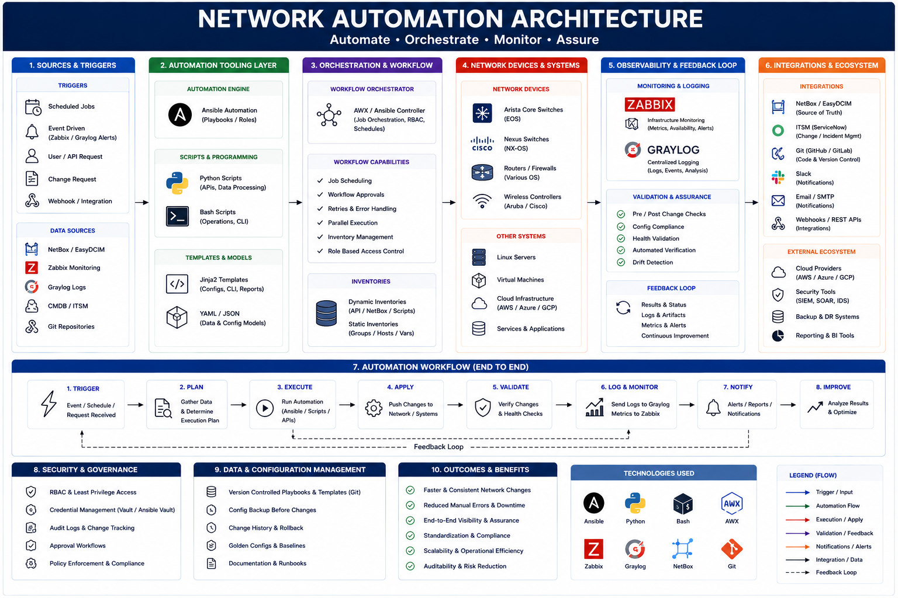

# Network Automation Architecture

---

# 🎯 Purpose

This document illustrates a generalized infrastructure automation architecture used for operational visibility, telemetry collection, orchestration workflows, and infrastructure monitoring.

The objective is to:
- centralize operational visibility
- standardize automation workflows
- improve telemetry collection
- support infrastructure observability
- improve operational consistency

---

# 🏗️ Architecture Overview

The automation environment includes:

- Infrastructure Devices
- Telemetry Collection
- Monitoring Systems
- Logging Pipelines
- REST API Integrations
- Orchestration Workflows
- Infrastructure Dashboards

---

# 📊 Infrastructure Components

Examples:
- Arista switches
- Cisco Nexus
- A10 Networks
- Linux servers
- WireGuard gateways
- monitoring systems
- telemetry platforms

---

# 🔍 Automation Workflow Areas

Examples:
- infrastructure auditing
- telemetry aggregation
- monitoring validation
- API orchestration
- infrastructure reporting
- configuration backups

---

# 📈 Operational Integrations

Recommended integrations:
- Zabbix
- Graylog
- REST APIs
- SNMP telemetry
- infrastructure dashboards

---

# 🖼️ Architecture Diagram

---

# 🔐 Security Considerations

Recommended:
- MFA enforcement
- centralized logging
- restricted automation access
- API authentication
- infrastructure segmentation

---

# ⚠️ Disclaimer

This document is intended for educational and operational reference purposes.
